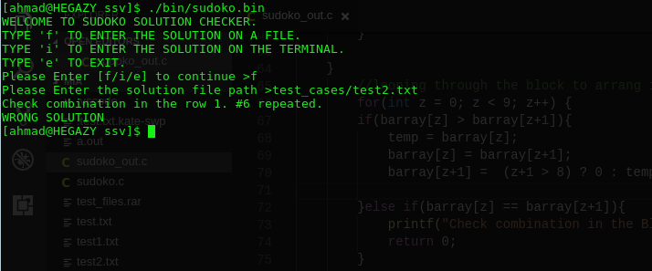

# Sudoko solution validator [SSV]
A C program that reads a sudoko solution and validate the solution is right OR giving the wrong answer's specific position.

## How to use it
- It's an interactive shell application that gives the user multiple choic of whether to write the input on the terminal or to write file path as it reads the solution from a file or standard input [stdin].
- As shown in the example it works using command line
> ./sudoko.bin #to run it

## Algorithm
- The used algorithm is pertty simple, After raeding the solution into a [9x9] multi dimension array:
1. Seperate the multi dimension array into rows and columnes.
2. Rearrang every row and column's elements and check repeated ones.
3. If it finds a repeated value it prints out the value's position and exists.
4. If not it will continue to the next step.
5. Seperate the multi dimension array into [3x3] blocks.
6. Put every block into an array.
7. Rearrang every Block elements and check repeated ones.
8. Point 3 and 4.
9. If it all went well it will till you that your solution is right.

- You can get use a binary file built on Windows10 at [bin](bin/sudoko.exe) directory.
- You can get the source code and build it using any C compiler at [src](src/sudoko.c) directory.
